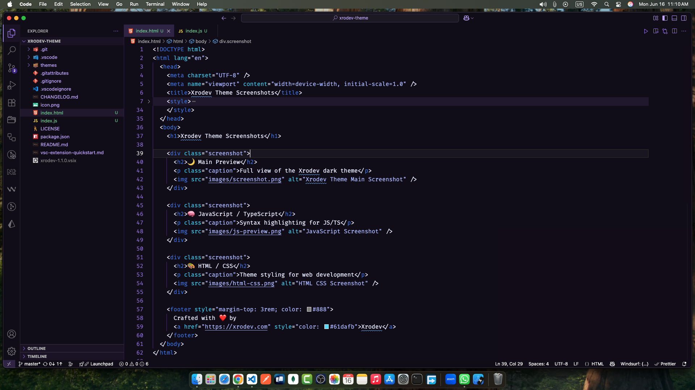
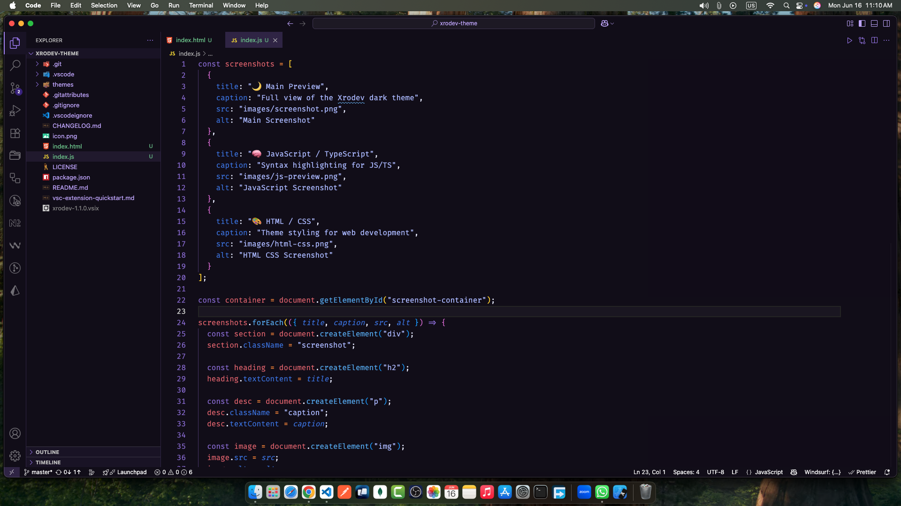

# 🌙 Xrodev Theme for VS Code

A sleek, modern, and developer-focused dark theme built for high productivity and visual comfort.




---

## ✨ Features

- Dark UI with vibrant syntax highlighting
- Carefully selected colors for accessibility and readability
- Great for web, UI, JS/TS, and backend developers
- Compatible with VS Code's latest versions

---

## 📸 Screenshots

### JavaScript / TypeScript


### HTML / CSS


---

## 🚀 Installation

1. Go to [Visual Studio Marketplace](https://marketplace.visualstudio.com/items?itemName=rayan2228.xrodev)  
2. Click **Install**  
3. Or install via VS Code:

```bash
ext install rayan2228.xrodev

```

## 🚀 About Xrodev

[Xrodev](https://xrodev.com) is a creative digital agency offering:

- 🔥 Web Development
- 🎯 Digital Marketing
- 🧠 AI Automation & Bots
- 🎨 UI/UX Design

We help startups and brands build scalable, user-friendly digital products that perform.

👉 Need a custom website, dashboard, or automation tool?  
📩 [contact@xrodev.com](mailto:contact@xrodev.com)

🔗 [xrodev.com](https://xrodev.com) | [Facebook](https://www.facebook.com/xrodev/) | [LinkedIn](https://www.linkedin.com/company/xrodev)

